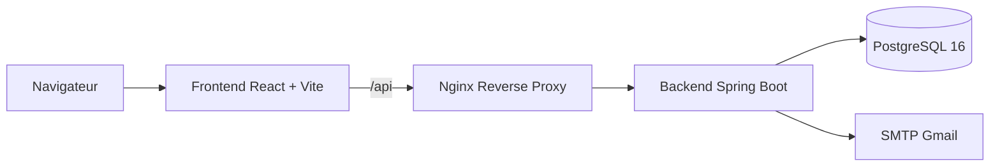
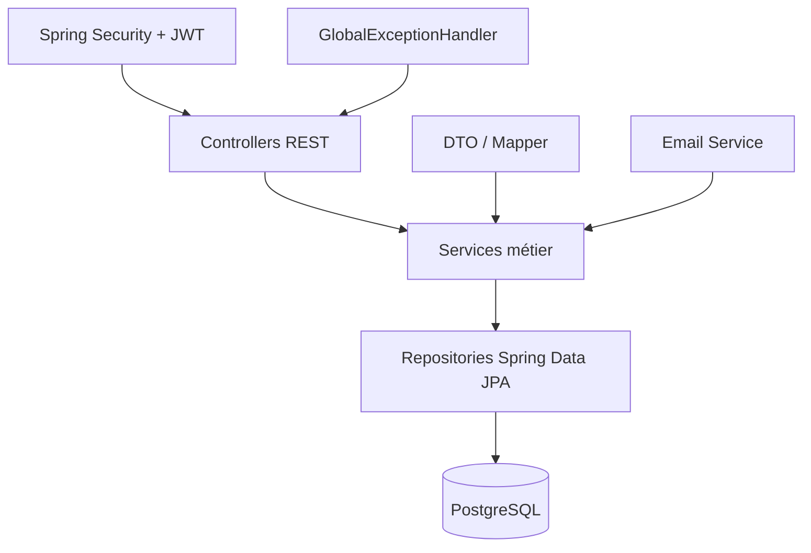
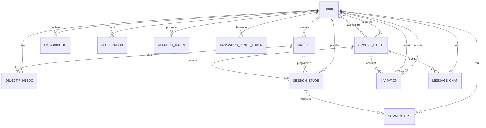
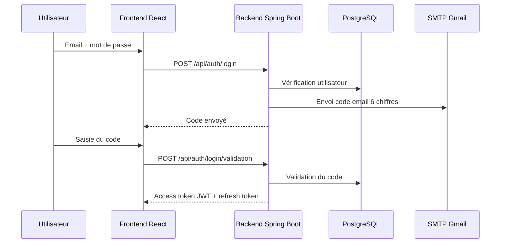

# 📚 Platforme Étude


**Platforme Étude** est une plateforme web collaborative destinée aux étudiants pour organiser leurs études, planifier automatiquement leurs sessions, suivre leurs objectifs hebdomadaires, gérer leurs disponibilités, collaborer dans des groupes d’étude, échanger via un chat intégré et recevoir des notifications.

Le projet inclut également un **espace administrateur** permettant de superviser les utilisateurs, les données principales de la plateforme, les sessions, les groupes, les notifications et les statistiques globales.

---

## 📑 Table des matières

- [Objectifs du projet](#-objectifs-du-projet)
- [Fonctionnalités principales](#-fonctionnalités-principales)
- [Architecture globale](#-architecture-globale)
- [Stack technique](#-stack-technique)
- [Structure du dépôt](#-structure-du-dépôt)
- [Modèle de données](#-modèle-de-données)
- [Authentification et sécurité](#-authentification-et-sécurité)
- [Installation locale](#-installation-locale)
- [Lancement avec Docker Compose](#-lancement-avec-docker-compose)
- [Déploiement Kubernetes](#-déploiement-kubernetes)
- [CI/CD GitHub Actions](#-cicd-github-actions)
- [Tests et validation](#-tests-et-validation)
- [Scénario de démonstration](#-scénario-de-démonstration)
- [Points d’attention](#-points-dattention)
- [Auteur](#-auteur)

---

## 🎯 Objectifs du projet

Platforme Étude a pour objectif d’aider un étudiant à organiser son travail hebdomadaire de manière structurée et collaborative.

L’utilisateur peut :

- déclarer ses matières ;
- fixer des objectifs d’heures par semaine ;
- définir ses disponibilités ;
- générer automatiquement un planning de sessions d’étude ;
- créer ou rejoindre des groupes d’étude ;
- échanger avec les membres d’un groupe via un chat intégré ;
- recevoir des notifications liées aux invitations, rappels et activités importantes ;
- consulter et modifier son profil ;
- utiliser un espace sécurisé avec authentification par JWT et validation email.

L’application vise à résoudre plusieurs problèmes fréquents chez les étudiants : désorganisation des révisions, difficulté à suivre les objectifs, manque de coordination dans le travail de groupe et absence d’un outil centralisé pour gérer les sessions d’étude.

---

## 🚀 Fonctionnalités principales

### 👤 Espace utilisateur

- Inscription et connexion sécurisée.
- Connexion en deux étapes avec code email.
- Réinitialisation du mot de passe par code email.
- Dashboard étudiant avec synthèse des données importantes.
- Gestion complète des matières.
- Gestion des objectifs hebdomadaires.
- Gestion des disponibilités.
- Création, modification, annulation et suppression des sessions d’étude.
- Génération automatique des sessions selon les objectifs, disponibilités et priorités.
- Création et administration de groupes d’étude.
- Système d’invitations par email.
- Chat de groupe avec contrôle d’accès.
- Centre de notifications.
- Page profil.

### 🛠️ Espace administrateur

- Dashboard administrateur.
- Visualisation des statistiques globales.
- Gestion des utilisateurs.
- Activation et désactivation des comptes.
- Changement de rôle utilisateur/admin.
- Supervision des sessions, groupes, notifications, matières, objectifs, disponibilités, messages et commentaires.
- Protections contre les actions critiques : suppression de son propre compte, désactivation de son propre compte, retrait du dernier administrateur actif.

---

## 🏗️ Architecture globale



### Description

L’application suit une architecture web moderne séparant clairement le frontend, le backend et la base de données.

- Le **frontend React** fournit l’interface utilisateur sous forme de SPA.
- **Vite** est utilisé en développement pour le serveur local et le build.
- En production, **Nginx** sert le build React et proxifie les requêtes `/api` vers le backend.
- Le **backend Spring Boot** expose une API REST sécurisée.
- **PostgreSQL** persiste les utilisateurs, sessions, objectifs, disponibilités, groupes, messages, invitations, notifications et tokens.
- **SMTP Gmail** est utilisé pour l’envoi des codes de validation email.

---

## 🧱 Architecture backend



Le backend est organisé en couches :

| Couche | Rôle |
| --- | --- |
| Controller | Expose les endpoints REST |
| Service | Contient la logique métier |
| Repository | Accès aux données avec Spring Data JPA |
| Entity | Modèle persistant JPA |
| DTO / Mapper | Transformation entre objets API et entités |
| Security | Authentification, autorisation, JWT, filtres |
| Exception Handler | Gestion centralisée des erreurs API |

---

## 🧩 Stack technique

| Couche | Technologies |
| --- | --- |
| Backend | Java 17, Spring Boot 4.0.5, Spring WebMVC, Spring Security, Spring Data JPA, Validation, Mail, Actuator |
| Authentification | JWT HS512, refresh tokens persistants, BCrypt, validation email par code |
| Base de données | PostgreSQL 16, Hibernate `ddl-auto=update` |
| Frontend | React 19.2.5, Vite 8.0.9, React Router 7.14.2, Axios 1.15.2 |
| UI | CSS modules par page, lucide-react, Recharts pour les vues admin |
| Tests | JUnit, Spring Security Test, Testcontainers PostgreSQL, H2, JaCoCo |
| DevOps | Docker, Docker Compose, Nginx, Kubernetes, GitHub Actions, SonarCloud |

---

## 📁 Structure du dépôt

```text
projet_inovation/
├── platforme_etude_backend/       # Backend Spring Boot
├── platforme_etude_frontend/      # Frontend React + Vite
├── docs/                          # Documentation projet et production
├── k8s/                           # Manifests Kubernetes
├── docker-compose.yml             # Compose de développement
├── docker-compose.prod.yml        # Compose de production locale
└── .github/workflows/ci.yml       # Pipeline CI GitHub Actions
```

---

## 🗄️ Modèle de données



### Entités principales

| Entité | Description |
| --- | --- |
| `User` | Identité, email unique, mot de passe hashé, rôle, statut actif, code de validation login |
| `RefreshToken` | Jeton long terme avec rotation et révocation |
| `PasswordResetToken` | Code hashé de réinitialisation, expiration, tentatives |
| `Matiere` | Matière appartenant à un utilisateur avec priorité |
| `ObjectifHebdo` | Nombre d’heures cible pour une matière pendant une semaine |
| `Disponibilite` | Jour de semaine et intervalle horaire libre |
| `SessionEtude` | Session planifiée, terminée ou annulée |
| `GroupeEtude` | Groupe d’étude avec admin et membres |
| `Invitation` | Invitation à rejoindre un groupe |
| `MessageChat` | Message envoyé dans le chat d’un groupe |
| `Notification` | Notification lue ou non lue |
| `Commentaire` | Commentaire lié à une session |

---

## 🔐 Authentification et sécurité

### Inscription

Lors de l’inscription, le frontend envoie les informations utilisateur et les informations d’authentification. Le backend :

- force le rôle à `ROLE_USER` ;
- normalise l’email en minuscules ;
- vérifie l’unicité de l’email ;
- hash le mot de passe avec BCrypt.

### Connexion en deux étapes



### Refresh token

- Le refresh token est stocké en base.
- À chaque refresh, l’ancien token est révoqué.
- Un nouveau refresh token est généré.
- Le logout révoque tous les refresh tokens de l’utilisateur.

### Mot de passe oublié

La réinitialisation du mot de passe utilise un code email :

- le backend retourne toujours un message générique pour éviter l’énumération d’emails ;
- le code est hashé avec BCrypt avant stockage ;
- le code expire après 10 minutes ;
- un cooldown de 60 secondes limite les renvois ;
- le reset est bloqué après 5 tentatives incorrectes ;
- le nouveau mot de passe doit être différent de l’ancien ;
- après reset, tous les refresh tokens sont révoqués.

---

## 🧭 Routes principales

### Routes frontend publiques

| Route | Description |
| --- | --- |
| `/login` | Connexion |
| `/signup` | Inscription |
| `/forgot-password` | Réinitialisation du mot de passe |
| `/unauthorized` | Accès refusé |
| `*` | Page 404 |

### Routes frontend utilisateur

| Route | Description |
| --- | --- |
| `/dashboard` | Dashboard étudiant |
| `/matieres` | Gestion des matières |
| `/objectifs` | Gestion des objectifs hebdomadaires |
| `/disponibilites` | Gestion des disponibilités |
| `/sessions` | Gestion et génération des sessions |
| `/groupes` | Groupes d’étude |
| `/groupes/:id/chat` | Chat de groupe |
| `/notifications` | Centre de notifications |
| `/profil` | Profil utilisateur |

### Routes frontend admin

| Route | Description |
| --- | --- |
| `/admin/dashboard` | Dashboard admin |
| `/admin/users` | Gestion des utilisateurs |
| `/admin/stats` | Statistiques |
| `/admin/sessions` | Supervision des sessions |
| `/admin/groupes` | Supervision des groupes |
| `/admin/notifications` | Supervision des notifications |
| `/admin/data` | Données métier |
| `/admin/settings` | Paramètres admin |

---

## ⚙️ Installation locale

### Prérequis

- Java 17+
- Maven
- Node.js 20+
- npm
- PostgreSQL 16
- Docker et Docker Compose, optionnel mais recommandé

### 1. Cloner le projet

```bash
git clone https://github.com/Yassbhr12/plateforme-etude.git
cd plateforme-etude
```

### 2. Configurer le backend

Créer ou adapter le fichier de configuration Spring selon l’environnement :

```properties
SPRING_DATASOURCE_URL=jdbc:postgresql://localhost:5432/platforme_etude_db
SPRING_DATASOURCE_USERNAME=postgres
SPRING_DATASOURCE_PASSWORD=change-me
SPRING_MAIL_USERNAME=your-email@gmail.com
SPRING_MAIL_PASSWORD=your-app-password
JWT_SECRET=une-cle-longue-et-secrete
```

Lancer le backend :

```bash
cd platforme_etude_backend
mvn spring-boot:run
```

Par défaut, l’API est disponible sur :

```text
http://localhost:8080
```

### 3. Configurer le frontend

```bash
cd platforme_etude_frontend
npm install
npm run dev
```

Selon la configuration locale, l’interface est disponible sur :

```text
http://localhost:5173
```

ou :

```text
http://localhost:5174
```

---

## 🐳 Lancement avec Docker Compose

### Production locale

Créer un fichier `.env` à la racine du projet :

```env
POSTGRES_DB=platforme_etude_db
POSTGRES_USER=postgres
POSTGRES_PASSWORD=change-me
SPRING_DATASOURCE_URL=jdbc:postgresql://postgres:5432/platforme_etude_db
SPRING_DATASOURCE_USERNAME=postgres
SPRING_DATASOURCE_PASSWORD=change-me
SPRING_MAIL_USERNAME=your-email@gmail.com
SPRING_MAIL_PASSWORD=your-app-password
JWT_SECRET=une-cle-longue-et-secrete
```

Lancer les services :

```bash
docker compose -f docker-compose.prod.yml up -d --build
```

Services lancés :

| Service | Description |
| --- | --- |
| `frontend` | Build React servi par Nginx sur le port `80` |
| `backend` | API Spring Boot sur le réseau Compose interne, port `8080` |
| `postgres` | PostgreSQL 16 avec volume persistant `pgdata` |

Accès :

```text
http://localhost
```

### Reconstruire après modification

```bash
docker compose -f docker-compose.prod.yml up -d --build --force-recreate
```

---

## ☸️ Déploiement Kubernetes

Le dossier `k8s/` contient les manifests nécessaires :

| Fichier | Rôle |
| --- | --- |
| `namespace.yaml` | Namespace `platforme-etude` |
| `postgres-configmap.yaml` | Configuration PostgreSQL non sensible |
| `postgres-secret.yaml` | Secret PostgreSQL |
| `postgres-pvc.yaml` | Volume persistant PostgreSQL |
| `postgres.yaml` | Deployment et Service PostgreSQL |
| `backend-configmap.yaml` | Configuration backend non sensible |
| `backend-secret.yaml` | Secrets backend : JWT, mail, datasource |
| `backend.yaml` | Deployment et Service backend |
| `frontend.yaml` | Deployment frontend et Service NodePort `30080` |

### Appliquer les manifests

```bash
kubectl apply -f k8s/namespace.yaml
kubectl apply -f k8s/
```

### Accès frontend

Le frontend est exposé via un service NodePort :

```text
http://<node-ip>:30080
```

> Important : les secrets Kubernetes contiennent des valeurs de type `CHANGE_ME`. Ils doivent être remplacés avant tout déploiement réel.

---

## 🔁 CI/CD GitHub Actions

Le projet contient un workflow GitHub Actions :

```text
.github/workflows/ci.yml
```

Le pipeline exécute :

1. les tests backend avec PostgreSQL de service et profil `test` ;
2. la génération du rapport JaCoCo ;
3. l’analyse SonarCloud ;
4. l’installation et le build du frontend ;
5. la validation de Docker Compose ;
6. le build des images Docker backend et frontend ;
7. le push Docker Hub sur la branche `main`, si les secrets Docker Hub sont configurés.

---

## 🧪 Tests et validation

### Backend

```bash
cd platforme_etude_backend
mvn clean verify
```

Les tests backend couvrent notamment :

- les services métier ;
- la sécurité ;
- les mappers ;
- la réinitialisation du mot de passe ;
- la gestion structurée des exceptions ;
- les comportements critiques autour des utilisateurs.

### Frontend

```bash
cd platforme_etude_frontend
npm install
npm run build
```

### Production locale

```bash
docker compose -f docker-compose.prod.yml up -d --build
```

---

## 🔄 Génération automatique des sessions

La génération automatique des sessions repose sur trois données minimales :

1. au moins une matière ;
2. au moins un objectif pour la semaine ;
3. au moins une disponibilité compatible.

Endpoint principal :

```http
POST /api/me/sessions/week/regenerate?date=YYYY-MM-DD
```

Règles principales :

- la date est normalisée au lundi de la semaine ;
- les sessions déjà planifiées sur cette semaine sont supprimées ;
- les sessions terminées sont conservées ;
- les objectifs de la semaine sont récupérés ;
- les disponibilités sont converties en créneaux réels ;
- les objectifs sont triés par priorité de matière ;
- les sessions générées durent au maximum 60 minutes ;
- les créneaux inférieurs à 15 minutes sont ignorés ;
- les sessions générées sont privées par défaut.

---

## 🧪 Scénario de démonstration recommandé

Pour tester l’application complète, utiliser trois comptes :

| Compte | Utilisation |
| --- | --- |
| Admin | Tester `/admin/**`, gestion utilisateurs, supervision |
| Utilisateur 1 | Créer matières, objectifs, disponibilités, sessions et groupes |
| Utilisateur 2 | Recevoir invitation, accepter, tester chat et notifications |

Étapes conseillées :

1. Se connecter avec l’utilisateur 1.
2. Créer trois matières avec priorités différentes.
3. Créer des objectifs pour la semaine courante.
4. Créer plusieurs disponibilités sans chevauchement.
5. Aller dans Sessions et lancer la génération automatique.
6. Vérifier que les sessions suivent les priorités et les disponibilités.
7. Créer un groupe avec l’utilisateur 1.
8. Inviter l’utilisateur 2 par email.
9. Se connecter avec l’utilisateur 2 dans une autre fenêtre.
10. Vérifier la notification et accepter l’invitation.
11. Ouvrir le chat depuis les deux comptes.
12. Envoyer des messages depuis chaque compte.
13. Se connecter en admin et vérifier les données dans les pages admin.

---

## ⚠️ Points d’attention

- Après modification du frontend, `npm run dev` affiche le code source courant, mais Docker sert le dernier build de l’image.
- Pour mettre à jour Docker après modification du frontend, reconstruire les images avec `--build --force-recreate`.
- Le volume PostgreSQL conserve les anciennes données.
- Supprimer le volume PostgreSQL efface la base de données.
- Le backend utilise actuellement `ddl-auto=update`.
- Pour une production stricte, il est recommandé d’utiliser des migrations versionnées.
- Les emails nécessitent un compte SMTP valide et un mot de passe d’application.
- `JWT_SECRET` doit être long, secret et suffisamment robuste.
- Les secrets Kubernetes doivent être remplacés avant tout déploiement réel.

---

## 📌 Améliorations possibles

- Ajouter HTTPS/TLS en production.
- Mettre en place des migrations Flyway ou Liquibase strictes.
- Ajouter plus de tests frontend.
- Ajouter une documentation OpenAPI/Swagger.
- Ajouter un monitoring applicatif plus avancé.
- Ajouter un environnement de staging.
- Automatiser le déploiement Kubernetes depuis la CI/CD.

---

## 👨‍💻 Auteur

Projet académique réalisé par **Yassine Bahra**.

Dépôt GitHub : `https://github.com/Yassbhr12/plateforme-etude`

---

## 📄 Licence

Ce projet est réalisé dans un cadre académique.
