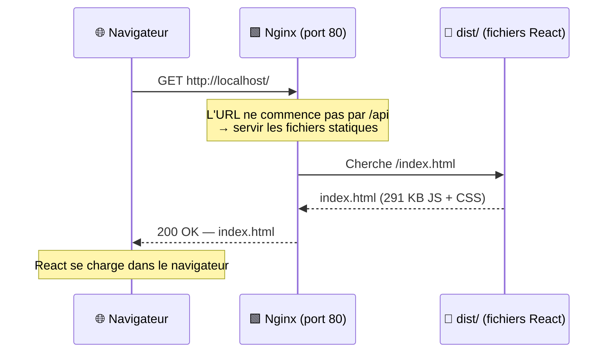
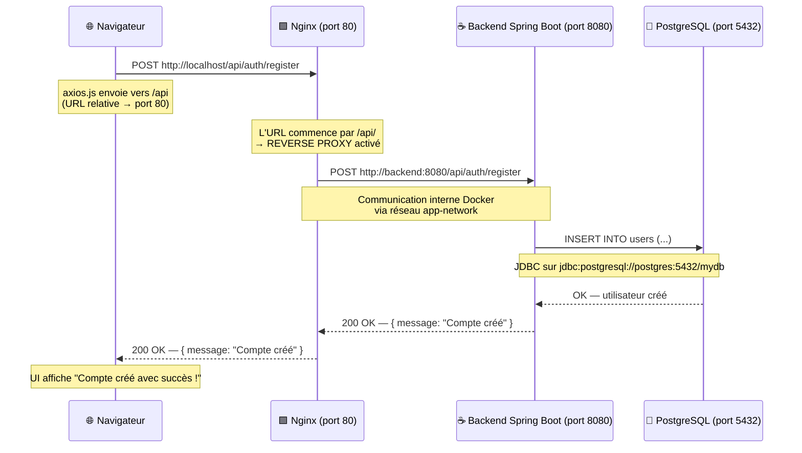
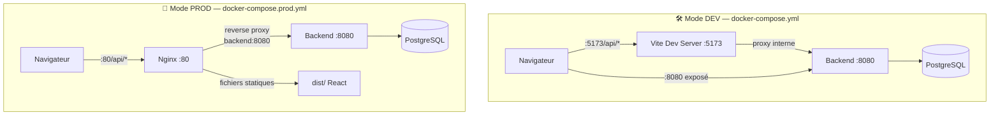
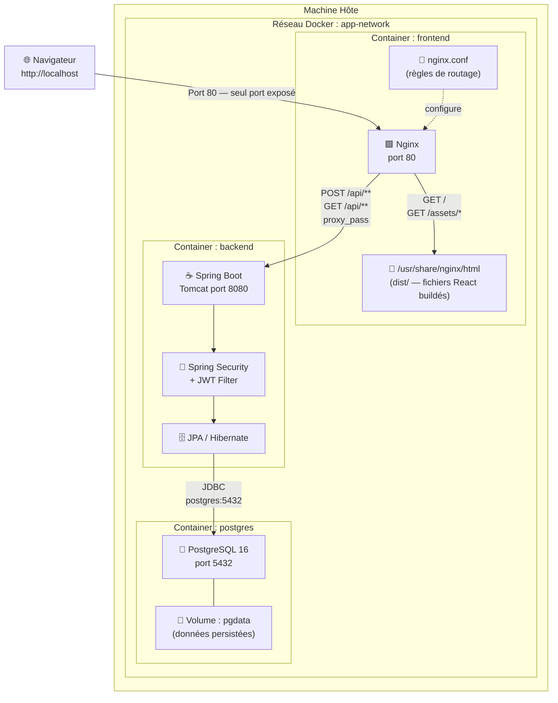

# 🏗️ Architecture de Production — Platforme Étude

> Ce document explique en détail l'architecture mise en place pour l'environnement de **production**
> (`docker-compose.prod.yml`), le rôle du reverse proxy Nginx, et le flux complet d'une requête
> depuis le navigateur jusqu'à la base de données.

---

## 1. Vue d'ensemble — Les 4 composants

```
┌──────────────────────────────────────────────────────────────────┐
│                        MACHINE HÔTE (ton PC / serveur)           │
│                                                                  │
│   Navigateur                                                     │
│   (Chrome/Firefox)                                               │
│        │                                                         │
│        │ HTTP  Port 80 (seul port ouvert vers l'extérieur)       │
│        ▼                                                         │
│  ┌─────────────────────────────────────────────────────────┐     │
│  │                   RÉSEAU DOCKER (app-network)           │     │
│  │                                                         │     │
│  │  ┌──────────────┐    ┌──────────────┐   ┌───────────┐  │     │
│  │  │   frontend   │    │   backend    │   │ postgres  │  │     │
│  │  │   (Nginx)    │───►│ (Spring Boot)│──►│ (Postgres)│  │     │
│  │  │   port 80    │    │  port 8080   │   │ port 5432 │  │     │
│  │  └──────────────┘    └──────────────┘   └───────────┘  │     │
│  │   ✅ EXPOSÉ           ❌ interne          ❌ interne     │     │
│  └─────────────────────────────────────────────────────────┘     │
└──────────────────────────────────────────────────────────────────┘
```

> **Règle clé :** En production, **un seul port est ouvert** vers l'extérieur : le **port 80** de Nginx.
> Le backend (8080) et la base de données (5432) sont invisibles depuis l'extérieur.

---

## 2. C'est quoi un Reverse Proxy ?

### Proxy classique (Forward Proxy)
Un proxy classique est du côté **client** — il intercepte les requêtes sortantes.

```
Client ──► PROXY ──► Internet
```
Exemple : proxy d'entreprise qui filtre les sites.

### Reverse Proxy
Un reverse proxy est du côté **serveur** — il intercepte les requêtes entrantes et les redistribue.

```
Internet ──► REVERSE PROXY ──► Serveur A (API)
                             ──► Serveur B (fichiers statiques)
                             ──► Serveur C (autre service)
```

**Nginx joue ce rôle dans notre architecture.**  
Il reçoit TOUTES les requêtes sur le port 80 et décide où les envoyer selon l'URL.

---

## 3. Diagramme de flux — Requête page React (GET /)



**Dans `nginx.conf` :**
```nginx
location / {
    try_files $uri $uri/ /index.html;  # Sert les fichiers React
}
```

---

## 4. Diagramme de flux — Requête API (POST /api/auth/register)



**Dans `nginx.conf` :**
```nginx
location /api/ {
    proxy_pass http://backend:8080/api/;   # Transfère au backend en interne
    proxy_set_header Host $host;
    proxy_set_header X-Real-IP $remote_addr;
    proxy_set_header X-Forwarded-For $proxy_add_x_forwarded_for;
    proxy_set_header X-Forwarded-Proto $scheme;
}
```

---

## 5. Pourquoi l'URL dans axios.js est `/api` (relative) ?

```js
// ❌ AVANT — URL absolue
const API_BASE_URL = 'http://localhost:8080/api';
//                             ↑
//                    Le navigateur cherche le port 8080
//                    sur TA machine → INTROUVABLE en prod

// ✅ APRÈS — URL relative
const API_BASE_URL = import.meta.env.VITE_API_URL || '/api';
//                                                     ↑
//                    Appelle la même origine que la page
//                    = http://localhost/api → port 80 → Nginx
```

Avec une URL **relative**, le navigateur appelle automatiquement le même hôte et port que la page web. Comme la page est sur le port 80 (Nginx), toutes les requêtes API passent par Nginx qui les redirige en interne.

---

## 6. Comparaison Dev vs Production



| | Dev | Production |
|---|---|---|
| **Serveur frontend** | Vite Dev Server | Nginx |
| **Port frontend** | 5173 | 80 |
| **Port backend** | 8080 (exposé) | 8080 (interne seulement) |
| **Qui gère `/api`** | Vite proxy | Nginx reverse proxy |
| **Hot reload** | ✅ Oui | ❌ Non (build statique) |
| **Build React** | ❌ Non compilé | ✅ `npm run build` → `dist/` |

---

## 7. Flux complet — Diagramme d'architecture détaillé



---

## 8. Les headers HTTP du Reverse Proxy — À quoi ça sert ?

Dans `nginx.conf`, on ajoute des headers avant de transférer la requête :

```nginx
proxy_set_header Host $host;
```
> Envoie l'adresse originale du site au backend (ex: `localhost`).
> Sans ça, le backend verrait `backend:8080` comme hôte, ce qui peut casser certaines redirections.

```nginx
proxy_set_header X-Real-IP $remote_addr;
```
> Envoie l'IP réelle du navigateur au backend.
> Sans ça, le backend verrait l'IP interne de Nginx (172.x.x.x) au lieu de l'IP du vrai client.

```nginx
proxy_set_header X-Forwarded-For $proxy_add_x_forwarded_for;
```
> Chaîne l'historique des IPs si plusieurs proxies sont impliqués (standard HTTP).

```nginx
proxy_set_header X-Forwarded-Proto $scheme;
```
> Indique au backend si la connexion originale était HTTP ou HTTPS.
> Utile pour que Spring Boot génère les bonnes URLs de redirection.

---

## 9. Commandes utiles

```bash
# Lancer l'environnement de production
docker compose -f docker-compose.prod.yml up --build

# Arrêter sans supprimer les données
docker compose -f docker-compose.prod.yml down

# Arrêter ET supprimer les données (reset base de données)
docker compose -f docker-compose.prod.yml down -v

# Lancer l'environnement de développement
docker compose up --build

# Voir les logs en temps réel
docker compose -f docker-compose.prod.yml logs -f backend
docker compose -f docker-compose.prod.yml logs -f frontend
```

---

*Document généré le 25 Avril 2026 — Platforme Étude / SGE*
