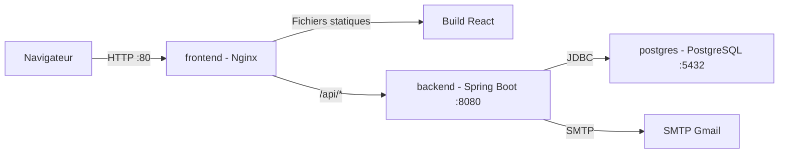

# Architecture de production

Derniere mise a jour : 02 juin 2026
Portee : Docker Compose production, Nginx, backend Spring Boot, PostgreSQL, Kubernetes et CI/CD.

## 1. Vue d'ensemble

L'architecture de production locale repose sur trois services Docker :



Le frontend est une SPA React compilee avec Vite. En production, le navigateur ne parle pas directement au backend. Il appelle `/api/...` sur le meme domaine que le frontend, puis Nginx transfere ces requetes au service Spring Boot.

## 2. Services Docker Compose

Le fichier `docker-compose.prod.yml` definit :

| Service | Image/build | Role | Exposition |
| --- | --- | --- | --- |
| `frontend` | build local `./platforme_etude_frontend` | sert la SPA React avec Nginx et proxifie `/api` | port host `80` vers conteneur `80` |
| `backend` | build local `./platforme_etude_backend` | API Spring Boot | expose `8080` uniquement dans le reseau Compose |
| `postgres` | `postgres:16-alpine` | base de donnees | interne au reseau Compose |

Tous les services partagent le reseau Docker `app-network`. Le volume `pgdata` persiste les donnees PostgreSQL entre les redemarrages.

## 3. Flux HTTP

### Chargement de l'application

1. Le navigateur ouvre `http://localhost:80`.
2. Nginx sert `index.html` et les assets Vite depuis `/usr/share/nginx/html`.
3. React Router gere les routes cote navigateur.
4. Pour toute route inconnue cote fichier, Nginx renvoie `index.html`.

### Appels API

1. Axios utilise `VITE_API_URL` si elle est definie.
2. Sinon Axios utilise `/api`.
3. En production Docker, une requete comme `/api/me/sessions` arrive sur Nginx.
4. Nginx proxifie vers `http://backend:8080/api/me/sessions`.
5. Le backend traite la requete et parle a PostgreSQL via `jdbc:postgresql://postgres:5432/...`.

## 4. Configuration Nginx

Le fichier `platforme_etude_frontend/nginx.conf` assure quatre roles :

| Bloc | Role |
| --- | --- |
| `location = /index.html` | sert l'entree SPA avec cache desactive |
| `location /` | fallback React Router vers `index.html` |
| `location /api/` | reverse proxy vers le backend Spring Boot |
| `location ~* ...` | cache long pour assets hashes Vite |

Extrait important :

```nginx
location /api/ {
    proxy_pass http://backend:8080/api/;
    proxy_set_header Host $host;
    proxy_set_header X-Real-IP $remote_addr;
    proxy_set_header X-Forwarded-For $proxy_add_x_forwarded_for;
    proxy_set_header X-Forwarded-Proto $scheme;
}
```

Le cache long est reserve aux fichiers statiques hashes. `index.html` est servi sans cache pour eviter que le navigateur garde une ancienne version de la SPA apres rebuild.

## 5. Variables d'environnement

Le backend lit ses variables depuis l'environnement Docker, avec des valeurs par defaut dans `application.properties`.

Variables attendues par `docker-compose.prod.yml` :

| Variable | Role |
| --- | --- |
| `POSTGRES_DB` | nom de la base creee par le conteneur PostgreSQL |
| `POSTGRES_USER` | utilisateur PostgreSQL |
| `POSTGRES_PASSWORD` | mot de passe PostgreSQL |
| `SPRING_DATASOURCE_URL` | URL JDBC utilisee par Spring |
| `SPRING_DATASOURCE_USERNAME` | utilisateur JDBC |
| `SPRING_DATASOURCE_PASSWORD` | mot de passe JDBC |
| `SPRING_MAIL_USERNAME` | compte SMTP |
| `SPRING_MAIL_PASSWORD` | mot de passe d'application SMTP |
| `JWT_SECRET` | cle secrete HS512 pour les JWT |

Exemple `.env` local :

```env
POSTGRES_DB=platforme_etude_db
POSTGRES_USER=postgres
POSTGRES_PASSWORD=change-me-local

SPRING_DATASOURCE_URL=jdbc:postgresql://postgres:5432/platforme_etude_db
SPRING_DATASOURCE_USERNAME=postgres
SPRING_DATASOURCE_PASSWORD=change-me-local

SPRING_MAIL_USERNAME=plateformedetude@gmail.com
SPRING_MAIL_PASSWORD=change-me-mail-app-password

JWT_SECRET=change-me-with-a-long-random-secret-at-least-64-characters
```

Attention : le healthcheck PostgreSQL actuel utilise `pg_isready -U postgres -d mydb`. Si `POSTGRES_DB` n'est pas `mydb`, il faut aligner le healthcheck avec la base configuree, par exemple `platforme_etude_db`.

## 6. Commandes Docker utiles

### Construire et lancer la production locale

```powershell
docker compose -f docker-compose.prod.yml up -d --build --force-recreate
```

### Voir les conteneurs

```powershell
docker compose -f docker-compose.prod.yml ps
```

### Lire les logs

```powershell
docker compose -f docker-compose.prod.yml logs -f frontend
docker compose -f docker-compose.prod.yml logs -f backend
docker compose -f docker-compose.prod.yml logs -f postgres
```

### Redemarrer seulement le frontend apres changement UI

```powershell
docker compose -f docker-compose.prod.yml up -d --build --force-recreate frontend
```

### Redemarrer toute la stack apres changement backend ou variables

```powershell
docker compose -f docker-compose.prod.yml up -d --build --force-recreate
```

### Supprimer les conteneurs sans effacer la base

```powershell
docker compose -f docker-compose.prod.yml down
```

### Supprimer aussi les donnees PostgreSQL

```powershell
docker compose -f docker-compose.prod.yml down -v
```

Cette derniere commande efface le volume `pgdata`.

## 7. Difference entre developpement et production

| Sujet | Developpement | Production Docker |
| --- | --- | --- |
| Frontend | `npm run dev`, code source servi par Vite | build statique servi par Nginx |
| Port frontend | souvent `5173` ou `5174` | `80` |
| API base URL | souvent `VITE_API_URL=http://localhost:8080/api` | `/api` |
| Backend | lance localement ou via Compose | service Docker interne |
| Rebuild necessaire | non pour Vite | oui apres changement frontend |
| Cache | faible | assets hashes caches longtemps, `index.html` sans cache |

Si `npm run dev` affiche une nouvelle page mais Docker affiche l'ancienne, c'est normal : Docker sert l'image construite. Il faut reconstruire l'image frontend.

## 8. Securite de production

### Secrets

Ne pas committer de vrais secrets dans le depot. Les valeurs sensibles doivent venir de `.env`, secrets GitHub Actions ou secrets Kubernetes.

Secrets critiques :

- `JWT_SECRET` ;
- `SPRING_DATASOURCE_PASSWORD` ;
- `SPRING_MAIL_PASSWORD` ;
- `POSTGRES_PASSWORD` ;
- credentials Docker Hub dans GitHub Actions.

### JWT

L'access token expire selon `jwt.expiration`, actuellement `900000` ms, soit 15 minutes. Le refresh token expire selon `jwt.refresh-expiration`, actuellement `604800000` ms, soit 7 jours.

### Mots de passe

Les mots de passe utilisateurs ne sont jamais stockes en clair. Ils sont hashes avec BCrypt. Les codes de reset de mot de passe sont aussi hashes avec BCrypt avant stockage.

### CORS

Le backend accepte les origines locales :

```text
http://localhost:*
http://127.0.0.1:*
```

Pour un vrai domaine de production, il faudra remplacer ou completer cette configuration avec le domaine final.

### HTTPS

Le Compose actuel expose HTTP sur le port `80`. Pour un deploiement public, ajouter HTTPS via un reverse proxy externe, un load balancer ou un ingress Kubernetes avec certificat TLS.

## 9. Kubernetes

Le dossier `k8s/` permet de deployer la plateforme dans un cluster Kubernetes.

### Namespace

Tous les objets sont places dans :

```yaml
namespace: platforme-etude
```

### PostgreSQL

Fichiers :

| Fichier | Role |
| --- | --- |
| `postgres-configmap.yaml` | `POSTGRES_DB=platforme_etude_db`, `POSTGRES_USER=postgres` |
| `postgres-secret.yaml` | `POSTGRES_PASSWORD` |
| `postgres-pvc.yaml` | volume persistant `1Gi` |
| `postgres.yaml` | Deployment PostgreSQL et Service `postgres:5432` |

### Backend

Fichiers :

| Fichier | Role |
| --- | --- |
| `backend-configmap.yaml` | datasource URL, username, `SPRING_JPA_HIBERNATE_DDL_AUTO=update` |
| `backend-secret.yaml` | password datasource, JWT, SMTP |
| `backend.yaml` | Deployment `yassbhr/platforme-etude-backend:latest` et Service `backend:8080` |

Le backend utilise `envFrom` pour charger le ConfigMap et le Secret.

### Frontend

Fichier :

| Fichier | Role |
| --- | --- |
| `frontend.yaml` | Deployment `yassbhr/platforme-etude-frontend:latest` et Service NodePort |

Le service frontend expose :

```yaml
type: NodePort
nodePort: 30080
```

L'application est donc accessible via l'IP du noeud Kubernetes et le port `30080` dans un environnement local type Minikube ou Docker Desktop Kubernetes.

### Ordre d'application recommande

```powershell
kubectl apply -f k8s/namespace.yaml
kubectl apply -f k8s/postgres-configmap.yaml
kubectl apply -f k8s/postgres-secret.yaml
kubectl apply -f k8s/postgres-pvc.yaml
kubectl apply -f k8s/postgres.yaml
kubectl apply -f k8s/backend-configmap.yaml
kubectl apply -f k8s/backend-secret.yaml
kubectl apply -f k8s/backend.yaml
kubectl apply -f k8s/frontend.yaml
```

### Verification Kubernetes

```powershell
kubectl get pods -n platforme-etude
kubectl get svc -n platforme-etude
kubectl logs -n platforme-etude deployment/backend-deployment
kubectl logs -n platforme-etude deployment/frontend-deployment
kubectl logs -n platforme-etude deployment/postgres-deployment
```

### Points d'attention Kubernetes

- Les secrets `CHANGE_ME...` doivent etre remplaces avant execution.
- Les images `latest` sont pratiques pour les tests, mais un tag versionne ou le SHA Git est preferable en production.
- Le frontend est expose en NodePort, pas encore via Ingress.
- Le backend n'a pas encore de probes Kubernetes explicites `readinessProbe` et `livenessProbe`.
- PostgreSQL est deploye dans le cluster pour simplifier le projet. En production reelle, une base managée est souvent preferable.

## 10. CI/CD GitHub Actions

Le workflow `.github/workflows/ci.yml` couvre :

| Job | Role |
| --- | --- |
| `backend` | lance PostgreSQL, execute `mvn clean verify`, genere JaCoCo, lance SonarCloud |
| `frontend` | installe les dependances avec `npm ci`, execute `npm run build` |
| `docker` | valide la configuration Docker Compose |
| `docker-build` | construit les images backend et frontend |
| `docker-push` | pousse les images sur Docker Hub depuis `main` |

Secrets GitHub necessaires :

| Secret | Role |
| --- | --- |
| `SONAR_TOKEN` | analyse SonarCloud |
| `DOCKERHUB_USERNAME` | login Docker Hub |
| `DOCKERHUB_TOKEN` | token Docker Hub |

## 11. Observabilite et diagnostic

### Backend

Spring Boot Actuator est present dans les dependances. Les endpoints Actuator ne sont pas detailles dans la configuration actuelle ; ils devront etre exposes explicitement si l'on veut des healthchecks HTTP complets.

Logs utiles :

```powershell
docker compose -f docker-compose.prod.yml logs -f backend
```

Erreurs frequentes :

| Symptome | Cause probable | Correction |
| --- | --- | --- |
| `failed to fetch oauth token ... auth.docker.io no such host` | probleme DNS ou reseau Docker | verifier connexion Internet, DNS Docker Desktop, proxy/VPN |
| Frontend ancien apres modification | image frontend non reconstruite ou cache navigateur | rebuild avec `--build --force-recreate`, recharger sans cache |
| Backend ne demarre pas | variable `.env` manquante ou `JWT_SECRET` invalide | verifier `.env` et logs backend |
| Emails non recus | SMTP mal configure ou mot de passe Gmail non valide | utiliser mot de passe d'application Gmail |
| Postgres unhealthy | healthcheck ne cible pas la bonne base | aligner `pg_isready -d` avec `POSTGRES_DB` |

### Frontend

Les erreurs API sont visibles dans la console navigateur et l'onglet Network. En production, verifier que les appels partent bien vers `/api/...` et non vers une ancienne URL absolue.

## 12. Checklist avant deploiement public

- Remplacer tous les secrets `CHANGE_ME...`.
- Utiliser un `JWT_SECRET` long et aleatoire.
- Activer HTTPS.
- Restreindre CORS au domaine final.
- Remplacer `latest` par des tags versionnes.
- Ajouter probes Kubernetes pour backend et frontend.
- Remplacer `ddl-auto=update` par des migrations versionnees.
- Ajouter sauvegarde PostgreSQL.
- Verifier la rotation et revocation des refresh tokens en environnement reel.
- Controler les logs SMTP et la delivrabilite des emails.
