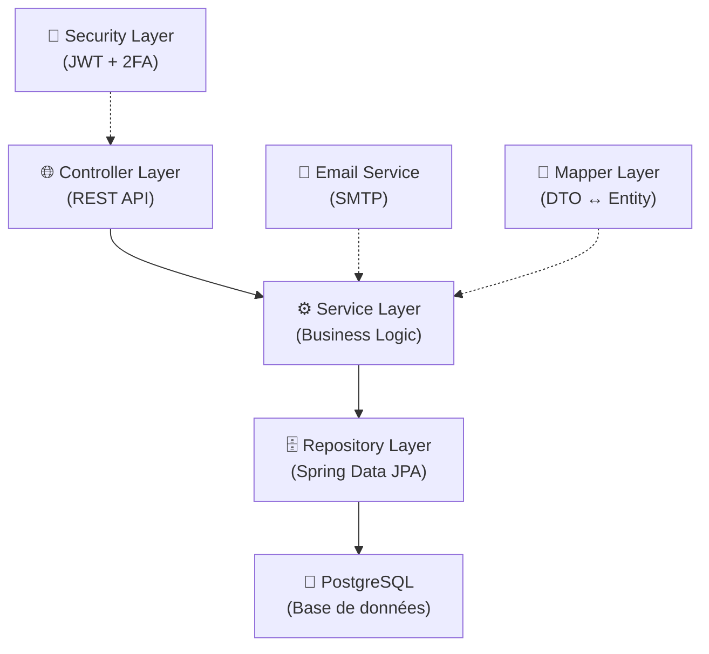
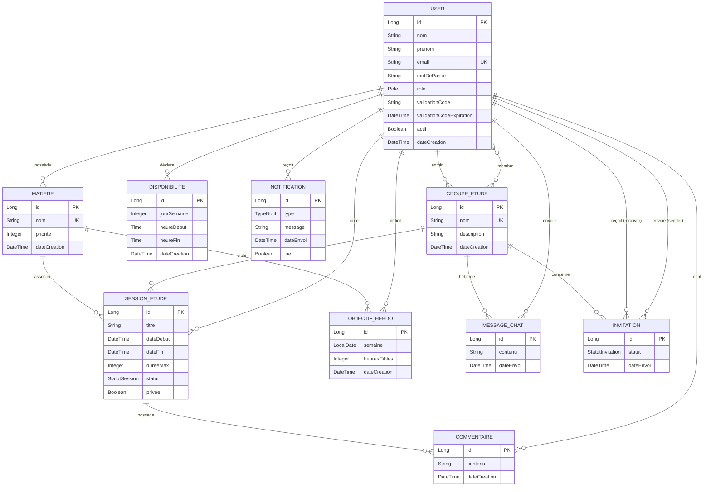
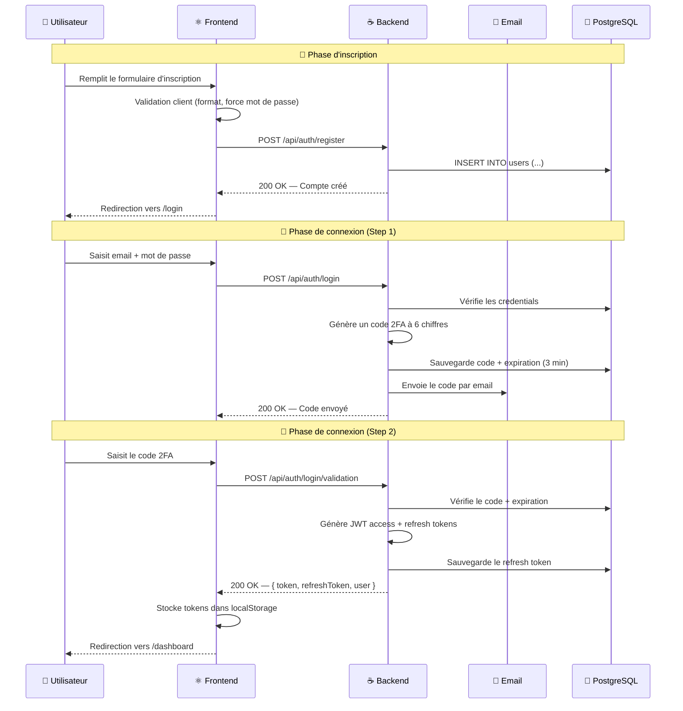
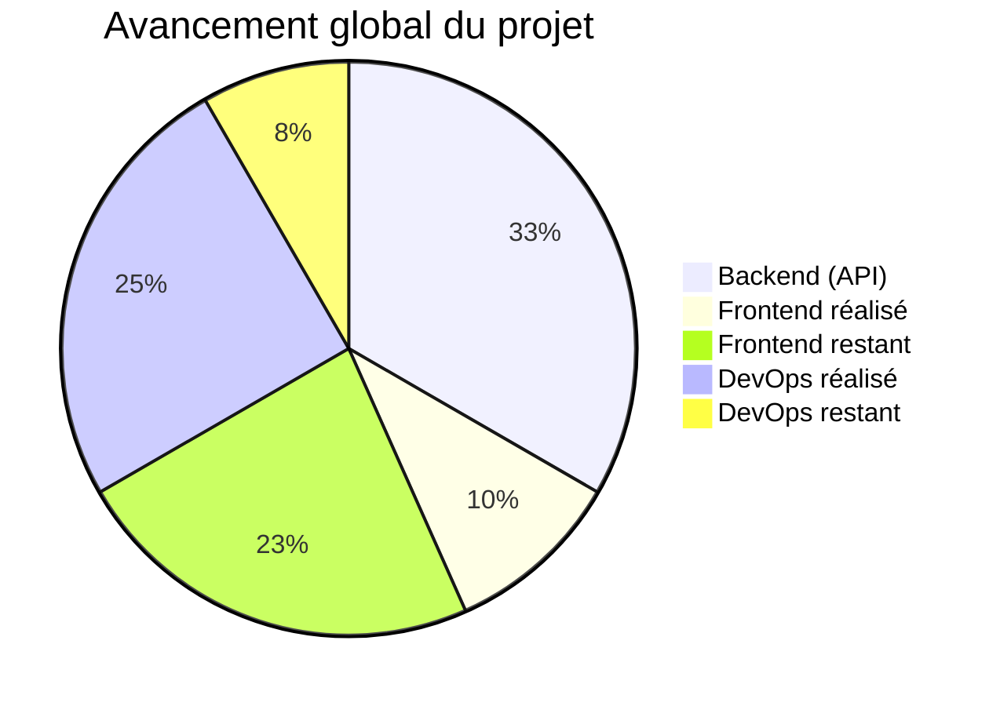

# 📚 Platforme Étude — Documentation Détaillée du Projet

> **Version** : 0.1.0-SNAPSHOT  
> **Dernière mise à jour** : 08 Mai 2026  
> **Organisation** : SGE (com.sge)

---

## 📋 Table des matières

1. [Objectif de l'application](#1--objectif-de-lapplication)
2. [Problème résolu](#2--problème-résolu)
3. [Architecture technique](#3--architecture-technique)
4. [Modèle de données](#4--modèle-de-données)
5. [Fonctionnalités détaillées](#5--fonctionnalités-détaillées)
6. [État d'avancement](#6--état-davancement)
7. [Stack technologique](#7--stack-technologique)

---

## 1. 🎯 Objectif de l'application

**Platforme Étude** est une plateforme web collaborative d'apprentissage conçue pour aider les étudiants à **organiser**, **planifier** et **optimiser** leurs sessions d'étude. L'application offre un écosystème complet où les apprenants peuvent :

- **Planifier des sessions d'étude** individuelles ou en groupe
- **Fixer et suivre des objectifs hebdomadaires** par matière
- **Collaborer en temps réel** au sein de groupes d'étude
- **Communiquer via un chat intégré** au sein des groupes
- **Recevoir des notifications intelligentes** (rappels de sessions, invitations, objectifs atteints)
- **Gérer leurs disponibilités** pour faciliter la coordination de groupe

La plateforme s'inscrit dans une vision de productivité étudiante centrée sur quatre piliers thématiques : **Calme 🧘**, **Concentration 🎯**, **Clarté 📊** et **Motivation 🚀**.

---

## 2. 🔍 Problème résolu

### Constat

Les étudiants font face à plusieurs difficultés majeures dans leur parcours d'apprentissage :

| Problème | Impact |
|----------|--------|
| **Désorganisation des révisions** | Les étudiants n'ont pas d'outil centralisé pour planifier leurs sessions d'étude de manière structurée |
| **Manque de suivi des objectifs** | Sans visibilité sur leur progression hebdomadaire par matière, ils perdent en motivation |
| **Isolement dans l'apprentissage** | L'étude individuelle prolongée mène à la démotivation et au décrochage |
| **Difficulté de coordination** | Organiser des sessions de groupe requiert de multiples outils (messagerie, agenda, etc.) |
| **Absence de responsabilisation** | Sans système de suivi, il est facile de repousser ou d'annuler des sessions |

### Solution apportée

Platforme Étude répond à ces problèmes en offrant **une plateforme unique** qui combine :

- ✅ **Planification structurée** — Création de sessions d'étude avec horaires, durée maximale et matière associée
- ✅ **Objectifs mesurables** — Définition d'heures cibles par matière et par semaine
- ✅ **Apprentissage collaboratif** — Groupes d'étude avec chat, sessions partagées et invitations
- ✅ **Notifications proactives** — Rappels de sessions, invitations de groupe, atteinte d'objectifs
- ✅ **Gestion des disponibilités** — Partage des créneaux disponibles pour faciliter la coordination
- ✅ **Sécurité renforcée** — Authentification 2FA par email pour protéger les comptes étudiants

---

## 3. 🏗️ Architecture technique

### Vue d'ensemble

```
┌──────────────────────────────────────────────────────────────────┐
│                        MACHINE HÔTE                              │
│                                                                  │
│   Navigateur (React SPA)                                         │
│        │                                                         │
│        │ HTTP                                                    │
│        ▼                                                         │
│  ┌─────────────────────────────────────────────────────────┐     │
│  │              RÉSEAU DOCKER (app-network)                │     │
│  │                                                         │     │
│  │  ┌──────────────┐    ┌──────────────┐   ┌───────────┐  │     │
│  │  │   Frontend   │    │   Backend    │   │ PostgreSQL│  │     │
│  │  │ (Nginx/Vite) │───►│ (Spring Boot)│──►│   (v16)   │  │     │
│  │  │  port 80/5173│    │  port 8080   │   │ port 5432 │  │     │
│  │  └──────────────┘    └──────────────┘   └───────────┘  │     │
│  └─────────────────────────────────────────────────────────┘     │
└──────────────────────────────────────────────────────────────────┘
```

### Architecture backend (couches)



### Deux modes de déploiement

| | Mode Développement | Mode Production |
|---|---|---|
| **Fichier** | `docker-compose.yml` | `docker-compose.prod.yml` |
| **Frontend** | Vite Dev Server (port 5173) | Nginx (port 80) |
| **Backend** | Port 8080 (exposé) | Port 8080 (interne) |
| **Proxy API** | Vite proxy | Nginx reverse proxy |
| **Hot reload** | ✅ Oui | ❌ Non |

---

## 4. 📊 Modèle de données

### Diagramme des entités



### Énumérations

| Enum | Valeurs | Description |
|------|---------|-------------|
| **Role** | `ROLE_ADMIN`, `ROLE_USER` | Rôles des utilisateurs |
| **StatutSession** | `PLANIFIEE`, `TERMINEE`, `ANNULEE` | État du cycle de vie d'une session |
| **StatutInvitation** | `EN_ATTENTE`, `ACCEPTEE`, `REFUSEE`, `ANNULEE` | État d'une invitation de groupe |
| **TypeNotif** | `RAPPEL_SESSION`, `INVITATION_GROUPE`, `OBJECTIF_ATTEINT` | Types de notifications |

---

## 5. 📦 Fonctionnalités détaillées

### 5.1 🔐 Authentification et Sécurité

| Fonctionnalité | Description |
|----------------|-------------|
| **Inscription** | Formulaire complet (nom, prénom, email, mot de passe) avec validation côté client et serveur |
| **Connexion en 2 étapes** | Étape 1 : Email + mot de passe → Étape 2 : Code 2FA à 6 chiffres envoyé par email |
| **Tokens JWT** | Access token pour l'authentification + Refresh token pour le renouvellement transparent |
| **Auto-refresh** | Intercepteur Axios qui renouvelle automatiquement le token expiré via le refresh token |
| **Déconnexion** | Révocation du refresh token côté serveur + nettoyage du localStorage |
| **Routes protégées** | Composant `ProtectedRoute` qui redirige vers `/login` si non authentifié |

#### Flux d'authentification détaillé



### 5.2 👤 Gestion des utilisateurs

| Fonctionnalité | Description |
|----------------|-------------|
| **Profil utilisateur** | Affichage des informations (nom, prénom, email, rôle) |
| **Rôles** | Distinction Admin / User avec permissions différenciées |
| **Gestion admin** | Interface d'administration pour la gestion des utilisateurs |
| **Activation/Désactivation** | Champ `actif` pour gérer l'état des comptes |

### 5.3 📖 Gestion des matières

| Fonctionnalité | Description |
|----------------|-------------|
| **CRUD matières** | Créer, lire, modifier, supprimer des matières personnelles |
| **Priorité** | Niveau de priorité de 0 à 5 pour hiérarchiser les matières |
| **Association** | Chaque matière est liée à un utilisateur et peut être associée à des sessions et objectifs |

### 5.4 📅 Sessions d'étude

| Fonctionnalité | Description |
|----------------|-------------|
| **Planification** | Création de sessions avec titre, date de début/fin, durée max (jusqu'à 180 min) |
| **Statuts** | Cycle de vie : `PLANIFIEE` → `TERMINEE` ou `ANNULEE` |
| **Visibilité** | Sessions privées ou partagées dans un groupe d'étude |
| **Commentaires** | Possibilité de commenter les sessions (retours, notes, etc.) |
| **Lien matière** | Chaque session est associée à une matière spécifique |

### 5.5 🎯 Objectifs hebdomadaires

| Fonctionnalité | Description |
|----------------|-------------|
| **Objectifs par matière** | Définir un nombre d'heures cibles (1-168h) par matière et par semaine |
| **Contrainte d'unicité** | Un seul objectif par combinaison utilisateur/matière/semaine |
| **Suivi** | Permet de mesurer la progression par rapport aux objectifs fixés |

### 5.6 👥 Groupes d'étude

| Fonctionnalité | Description |
|----------------|-------------|
| **Création de groupes** | Créer un groupe avec nom (unique) et description (jusqu'à 1000 caractères) |
| **Administration** | Chaque groupe a un administrateur (créateur) |
| **Membres** | Relation many-to-many entre utilisateurs et groupes |
| **Sessions de groupe** | Planifier des sessions au sein d'un groupe |
| **Chat intégré** | Messagerie en temps réel au sein du groupe (messages jusqu'à 2000 caractères) |

### 5.7 ✉️ Système d'invitations

| Fonctionnalité | Description |
|----------------|-------------|
| **Envoi d'invitation** | Un membre peut inviter d'autres utilisateurs à rejoindre un groupe |
| **Flux d'acceptation** | `EN_ATTENTE` → `ACCEPTEE` / `REFUSEE` / `ANNULEE` |
| **Traçabilité** | Historique des invitations envoyées et reçues |

### 5.8 🔔 Notifications

| Fonctionnalité | Description |
|----------------|-------------|
| **Rappel de session** | Notification avant le début d'une session planifiée |
| **Invitation de groupe** | Notification lors de la réception d'une invitation |
| **Objectif atteint** | Notification lorsqu'un objectif hebdomadaire est accompli |
| **Statut lu/non-lu** | Gestion de l'état de lecture des notifications |

### 5.9 🕐 Gestion des disponibilités

| Fonctionnalité | Description |
|----------------|-------------|
| **Créneaux hebdomadaires** | Déclarer ses disponibilités par jour de la semaine (1-7) |
| **Horaires** | Heure de début et heure de fin pour chaque créneau |
| **Coordination** | Facilite la planification de sessions de groupe en fonction des disponibilités partagées |

### 5.10 💬 Chat de groupe

| Fonctionnalité | Description |
|----------------|-------------|
| **Messagerie** | Envoi de messages texte (jusqu'à 2000 caractères) au sein d'un groupe |
| **Historique** | Conservation de l'historique des messages avec horodatage |
| **Identification** | Chaque message est lié à son auteur et au groupe |

---

## 6. ✅ État d'avancement

### Légende

| Icône | Signification |
|-------|---------------|
| ✅ | Réalisé et fonctionnel |
| 🔨 | Backend réalisé, frontend à faire |
| ❌ | Non commencé |

---

### 6.1 Backend (Spring Boot)

| Module | État | Détails |
|--------|------|---------|
| **Structure du projet** | ✅ | Architecture en couches (Controller → Service → Repository → Entity) |
| **Modèle de données** | ✅ | 10 entités JPA avec validations et relations complètes |
| **Authentification (register, login, 2FA, JWT, refresh)** | ✅ | Flux complet implémenté avec Spring Security |
| **UserService / UserController** | ✅ | CRUD utilisateur + gestion du profil |
| **AdminController** | ✅ | Endpoints d'administration |
| **MatiereService / MatiereController** | ✅ | CRUD complet des matières |
| **SessionEtudeService / SessionEtudeController** | ✅ | Gestion des sessions d'étude |
| **ObjectifHebdoService / ObjectifHebdoController** | ✅ | Gestion des objectifs hebdomadaires |
| **GroupeEtudeService / GroupeEtudeController** | ✅ | Gestion des groupes d'étude |
| **InvitationService / InvitationController** | ✅ | Système d'invitations complet |
| **NotificationService / NotificationController** | ✅ | Gestion des notifications |
| **MessageChatService / MessageChatController** | ✅ | Chat de groupe |
| **CommentaireService / CommentaireController** | ✅ | Commentaires sur les sessions |
| **DisponibiliteService / DisponibiliteController** | ✅ | Gestion des disponibilités |
| **EmailService** | ✅ | Envoi d'emails (codes 2FA) via Spring Mail |
| **JwtFilter / JwtUtils** | ✅ | Filtre JWT et utilitaires de génération/validation |
| **SecurityConfig** | ✅ | Configuration Spring Security complète |
| **RefreshTokenService** | ✅ | Gestion des refresh tokens |
| **Mappers (DTO ↔ Entity)** | ✅ | 10 mappers pour toutes les entités |
| **Flyway migrations** | ✅ | Gestion versionnée du schéma de base de données |
| **OWASP Dependency Check** | ✅ | Plugin Maven configuré (seuil CVSS ≥ 7) |

### 6.2 Frontend (React + Vite)

| Module | État | Détails |
|--------|------|---------|
| **Design System (CSS variables)** | ✅ | Thème complet Calm/Concentration/Clarity/Motivation avec 40+ tokens CSS |
| **Typographie** | ✅ | Inter + Space Grotesk importées depuis Google Fonts |
| **Page de connexion (Login)** | ✅ | Formulaire en 2 étapes avec 2FA, timer d'expiration, saisie du code avec auto-focus |
| **Page d'inscription (Signup)** | ✅ | Formulaire complet avec validation, indicateur de force du mot de passe |
| **Page Dashboard** | ✅ | Page d'accueil post-connexion avec infos utilisateur (page placeholder) |
| **AuthContext** | ✅ | Context React pour la gestion de l'état d'authentification |
| **Service d'authentification (authService)** | ✅ | Fonctions register, login, validateCode, refreshToken, logout |
| **Intercepteurs Axios** | ✅ | Injection automatique du token + auto-refresh sur 401 |
| **ProtectedRoute** | ✅ | Composant de protection des routes avec loader |
| **Routing (react-router-dom)** | ✅ | Routes /login, /signup, /dashboard avec redirection par défaut |
| **Animations CSS** | ✅ | Floating orbs, card slide-in, shake errors, fade-in alerts |
| **Responsive Design** | ✅ | Breakpoints à 968px et 480px |
| **SEO** | ✅ | Balises meta, description, theme-color, lang="fr" |
| **Dashboard complet** | ❌ | Interface de gestion des sessions, matières, objectifs |
| **Page Matières** | ❌ | CRUD frontend des matières |
| **Page Sessions** | ❌ | Planification et suivi des sessions |
| **Page Objectifs** | ❌ | Définition et suivi des objectifs hebdomadaires |
| **Page Groupes** | ❌ | Gestion des groupes d'étude |
| **Chat de groupe** | ❌ | Interface de messagerie de groupe |
| **Notifications** | ❌ | Centre de notifications |
| **Disponibilités** | ❌ | Interface de gestion des créneaux |
| **Invitations** | ❌ | Interface d'envoi/gestion des invitations |
| **Profil utilisateur** | ❌ | Page de profil éditable |

### 6.3 Infrastructure / DevOps

| Module | État | Détails |
|--------|------|---------|
| **Docker Compose (dev)** | ✅ | 3 services : frontend (Vite), backend (Spring), PostgreSQL |
| **Docker Compose (prod)** | ✅ | 3 services avec réseau isolé `app-network` |
| **Dockerfile frontend (dev)** | ✅ | Image Node avec Vite Dev Server |
| **Dockerfile frontend (prod)** | ✅ | Build multi-stage : Node → Nginx |
| **Dockerfile backend** | ✅ | Build Maven → JRE |
| **Nginx reverse proxy** | ✅ | Proxy `/api/` vers backend, SPA fallback, gzip, cache assets |
| **Volume PostgreSQL** | ✅ | Persistance des données via volume `pgdata` |
| **Documentation architecture** | ✅ | Document détaillé avec diagrammes Mermaid |
| **Diagrammes de classe** | ✅ | 2 versions de diagrammes UML (PDF) |
| **CI/CD** | ❌ | Pipeline d'intégration/déploiement continu |
| **Tests automatisés** | ❌ | Tests unitaires et d'intégration |
| **HTTPS / SSL** | ❌ | Certificats et configuration TLS |

---

### Résumé de progression



| Couche | Progression estimée |
|--------|:-------------------:|
| **Backend (API REST)** | █████████████████████ **100%** |
| **Frontend (UI)** | ██████░░░░░░░░░░░░░░ **~30%** |
| **Infrastructure** | ███████████████░░░░░ **~75%** |
| **Global** | ████████████░░░░░░░░ **~60%** |

---

## 7. 🛠️ Stack technologique

### Backend

| Technologie | Version | Rôle |
|-------------|---------|------|
| **Java** | 17 | Langage principal |
| **Spring Boot** | 4.0.5 | Framework applicatif |
| **Spring Security** | — | Authentification & autorisation |
| **Spring Data JPA** | — | Accès aux données (ORM Hibernate) |
| **Spring Mail** | — | Envoi d'emails (2FA) |
| **Spring Validation** | — | Validation des données d'entrée |
| **Flyway** | — | Migrations de base de données |
| **JJWT** | 0.11.5 | Génération & validation de tokens JWT |
| **Lombok** | — | Réduction du boilerplate Java |
| **PostgreSQL** | 16 (Alpine) | Base de données relationnelle |
| **Maven** | — | Build & gestion des dépendances |
| **OWASP Dependency Check** | 10.0.4 | Audit de sécurité des dépendances |

### Frontend

| Technologie | Version | Rôle |
|-------------|---------|------|
| **React** | 19.2.5 | Bibliothèque UI |
| **Vite** | 8.0.9 | Build tool & dev server |
| **React Router DOM** | 7.14.2 | Navigation SPA |
| **Axios** | 1.15.2 | Client HTTP |
| **Vanilla CSS** | — | Styles & design system |
| **Google Fonts** | — | Inter + Space Grotesk |

### Infrastructure

| Technologie | Rôle |
|-------------|------|
| **Docker** | Conteneurisation |
| **Docker Compose** | Orchestration multi-conteneurs |
| **Nginx** | Serveur web & reverse proxy (production) |

---

## DevOps

Ce projet utilise une approche DevOps afin d'automatiser le développement, les tests, la conteneurisation et le déploiement de l'application.

### Technologies DevOps utilisées

- Git et GitHub pour la gestion du code source
- Docker pour la conteneurisation du frontend, du backend et de la base de données
- Docker Compose pour orchestrer les services
- GitHub Actions pour l'intégration continue et le déploiement continu
- PostgreSQL comme base de données conteneurisée
- Nginx comme serveur web et reverse proxy en production

### Objectif CI/CD

L'objectif du pipeline CI/CD est de vérifier automatiquement le projet à chaque modification du code.

Le pipeline pourra faire les étapes suivantes :

1. Récupérer le code depuis GitHub
2. Installer les dépendances du frontend et du backend
3. Lancer les tests
4. Construire le frontend React/Vite
5. Construire le backend Spring Boot
6. Construire les images Docker
7. Déployer l'application

*Document généré le 08 Mai 2026 — Platforme Étude / SGE*
