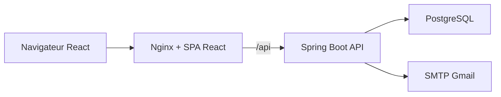
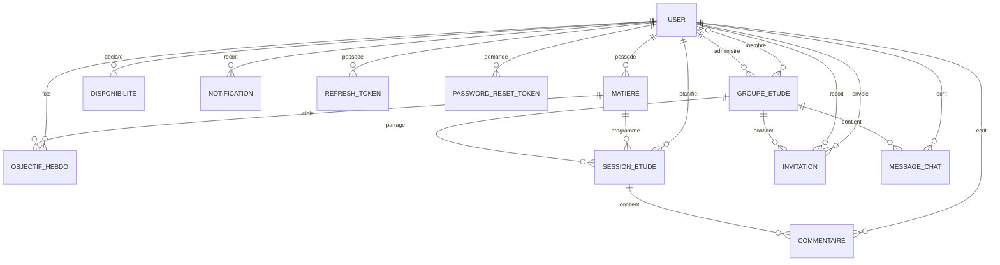

# Platforme Etude - Documentation du projet

Derniere mise a jour : 02 juin 2026
Version backend : `0.0.1-SNAPSHOT`
Statut : backend, frontend, Docker, Kubernetes et CI documentes selon l'etat courant du depot.

## 1. Objectif du projet

Platforme Etude est une application web qui aide un etudiant a organiser son travail hebdomadaire. L'utilisateur peut declarer ses matieres, fixer des objectifs d'heures par semaine, definir ses disponibilites, puis generer automatiquement un planning de sessions d'etude. L'application ajoute aussi une partie collaborative avec groupes d'etude, invitations, notifications et chat de groupe.

Le projet contient egalement une interface administrateur permettant de superviser les utilisateurs et les donnees principales creees dans la plateforme.

## 2. Structure generale du depot

```text
projet_inovation/
  platforme_etude_backend/      Backend Spring Boot
  platforme_etude_frontend/     Frontend React + Vite
  docs/                         Documentation projet et production
  k8s/                          Manifests Kubernetes
  docker-compose.yml            Compose de developpement
  docker-compose.prod.yml       Compose de production locale
  .github/workflows/ci.yml      CI GitHub Actions
```

## 3. Stack technique

| Couche | Technologies |
| --- | --- |
| Backend | Java 17, Spring Boot 4.0.5, Spring WebMVC, Spring Security, Spring Data JPA, Validation, Mail, Actuator |
| Authentification | JWT HS512, refresh tokens persistants, BCrypt, validation email par code |
| Base de donnees | PostgreSQL 16, Hibernate `ddl-auto=update` |
| Frontend | React 19.2.5, Vite 8.0.9, React Router 7.14.2, Axios 1.15.2 |
| UI | CSS modules par page, lucide-react, Recharts pour les vues admin |
| Tests | JUnit, Spring Security Test, Testcontainers PostgreSQL, H2 pour certains tests, JaCoCo |
| DevOps | Docker, Docker Compose, Nginx, Kubernetes, GitHub Actions, SonarCloud |

## 4. Architecture fonctionnelle



En developpement, Vite sert l'interface sur un port local comme `5173` ou `5174`. En production locale, Nginx sert le build React sur le port `80` et proxifie toutes les requetes `/api/` vers le backend Spring Boot.

## 5. Roles et espaces applicatifs

L'application gere deux roles :

| Role | Acces principal |
| --- | --- |
| `ROLE_USER` | Dashboard etudiant, matieres, objectifs, disponibilites, sessions, groupes, invitations, chat, notifications, profil |
| `ROLE_ADMIN` | Espace admin, supervision utilisateurs, donnees globales, statistiques, sessions, groupes, notifications, parametres |

Les routes React sont separees par garde :

| Type | Routes |
| --- | --- |
| Publiques | `/login`, `/signup`, `/forgot-password`, `/unauthorized`, page 404 |
| Utilisateur connecte | `/dashboard`, `/matieres`, `/objectifs`, `/disponibilites`, `/sessions`, `/groupes`, `/groupes/:id/chat`, `/notifications`, `/profil` |
| Admin | `/admin/dashboard`, `/admin/users`, `/admin/stats`, `/admin/sessions`, `/admin/groupes`, `/admin/notifications`, `/admin/data`, `/admin/settings` |

## 6. Modele de donnees



### Entites principales

| Entite | Role |
| --- | --- |
| `User` | Identite, email unique, mot de passe hashé, role, statut actif, code de validation login |
| `RefreshToken` | Jeton long terme, rotation et revocation des sessions connectees |
| `PasswordResetToken` | Code hashé de reinitialisation, expiration, tentatives, date d'utilisation |
| `Matiere` | Matiere d'un utilisateur avec priorite numerique |
| `ObjectifHebdo` | Nombre d'heures cible pour une matiere et une semaine normalisee au lundi |
| `Disponibilite` | Jour de semaine et intervalle horaire libre |
| `SessionEtude` | Session planifiee, terminee ou annulee, privee ou partagee dans un groupe |
| `GroupeEtude` | Groupe avec un admin et une liste de membres |
| `Invitation` | Invitation d'un utilisateur vers un autre pour rejoindre un groupe |
| `MessageChat` | Message envoye dans le chat d'un groupe |
| `Notification` | Notification lue/non lue liee aux invitations ou rappels |
| `Commentaire` | Commentaire rattache a une session |

## 7. Authentification et securite

### Inscription

Le frontend envoie :

```json
{
  "user": {
    "nom": "Bahra",
    "prenom": "Yassine",
    "role": "ROLE_USER"
  },
  "auth": {
    "email": "user@example.com",
    "password": "Yassbhr12"
  }
}
```

Le backend force le role a `ROLE_USER`, normalise l'email en minuscules, verifie l'unicite par `findByEmailIgnoreCase`, puis hash le mot de passe avec BCrypt.

### Connexion en deux etapes

1. `POST /api/auth/login` verifie email, mot de passe et statut actif.
2. Si les informations sont correctes, un code a 6 chiffres est envoye par email.
3. `POST /api/auth/login/validation` valide le code et retourne un access token JWT et un refresh token.

Le code de connexion expire apres 3 minutes. Apres validation, le code est efface et les anciens refresh tokens de l'utilisateur sont revoques.

### Refresh token et logout

Le refresh token est stocke en base dans `refresh_tokens`. A chaque refresh, l'ancien token est revoque et un nouveau token est cree. Le logout revoque tous les refresh tokens de l'utilisateur.

### Mot de passe oublie

La fonctionnalite de reinitialisation est implementee avec un code email :

1. `POST /api/auth/password/forgot` recoit l'email.
2. Le backend repond toujours avec un message generique pour eviter l'enumeration d'emails.
3. Si l'utilisateur existe et est actif, un code a 6 chiffres est genere.
4. Le code n'est jamais stocke en clair : seul son hash BCrypt est persiste dans `password_reset_tokens`.
5. Le code expire apres 10 minutes.
6. Un nouveau code ne peut pas etre renvoye trop vite : cooldown de 60 secondes.
7. Le reset bloque apres 5 tentatives incorrectes.
8. Le nouveau mot de passe doit etre different de l'ancien.
9. Apres reset, tous les refresh tokens de l'utilisateur sont revoques.

### Configuration Spring Security

| Route backend | Protection |
| --- | --- |
| `/api/auth/register` | publique |
| `/api/auth/login` | publique |
| `/api/auth/login/validation` | publique |
| `/api/auth/password/forgot` | publique |
| `/api/auth/password/reset` | publique |
| `/api/auth/refresh` | publique |
| `/api/auth/logout` | publique |
| `/api/me/**`, `/api/profil/**`, `/api/groupes/**`, `/api/messages/**`, `/api/commentaires/**`, `/api/sessions/**` | `ROLE_USER` ou `ROLE_ADMIN` |
| `/api/admin/**` | `ROLE_ADMIN` |

Le backend est stateless, utilise le header `Authorization: Bearer <token>`, et accepte les origines locales `http://localhost:*` et `http://127.0.0.1:*` pour faciliter les tests Vite et Docker.

## 8. Fonctionnalites utilisateur

### Dashboard

Le dashboard consolide les donnees importantes de l'etudiant : progression hebdomadaire, sessions, objectifs, groupes, prochaines sessions et notifications recentes. Il sert de point d'entree apres connexion pour un utilisateur standard.

### Matieres

L'utilisateur peut creer, modifier, lister et supprimer ses matieres. Chaque matiere porte une priorite numerique. Plus la priorite est faible, plus elle est traitee tot par l'algorithme de generation des sessions.

API principale :

| Methode | Endpoint | Role |
| --- | --- | --- |
| `GET` | `/api/me/matieres` | lister mes matieres |
| `POST` | `/api/me/matieres` | creer une matiere |
| `PUT` | `/api/me/matieres/{id}` | modifier ma matiere |
| `DELETE` | `/api/me/matieres/{id}` | supprimer ma matiere |

### Objectifs hebdomadaires

Un objectif definit le nombre d'heures a consacrer a une matiere pendant une semaine. La date envoyee est normalisee au lundi de la semaine. Le backend empeche de creer deux objectifs pour le meme utilisateur, la meme matiere et la meme semaine.

API principale :

| Methode | Endpoint | Role |
| --- | --- | --- |
| `GET` | `/api/me/objectifs` | lister tous mes objectifs |
| `GET` | `/api/me/objectifs/week?date=YYYY-MM-DD` | lister les objectifs d'une semaine |
| `GET` | `/api/me/matieres/{matiereId}/objectifs` | objectifs d'une matiere |
| `POST` | `/api/me/objectifs` | creer un objectif |
| `PUT` | `/api/me/objectifs/{id}` | modifier un objectif |
| `DELETE` | `/api/me/objectifs/{id}` | supprimer un objectif |

### Disponibilites

Une disponibilite correspond a un jour de semaine (`1` a `7`) et a une plage horaire. Le backend refuse :

- une heure de debut apres ou egale a l'heure de fin ;
- deux disponibilites qui se chevauchent pour le meme utilisateur et le meme jour ;
- la modification ou suppression d'une disponibilite qui n'appartient pas a l'utilisateur courant.

API principale :

| Methode | Endpoint | Role |
| --- | --- | --- |
| `GET` | `/api/me/disponibilites` | lister mes disponibilites |
| `POST` | `/api/me/disponibilites` | creer une disponibilite |
| `PUT` | `/api/me/disponibilites/{id}` | modifier une disponibilite |
| `DELETE` | `/api/me/disponibilites/{id}` | supprimer une disponibilite |

### Sessions d'etude

L'utilisateur peut creer des sessions manuelles, les modifier, les annuler, les marquer terminees, les supprimer ou les partager dans un groupe. Une session ne peut pas chevaucher une autre session non annulee du meme jour. Une session manuelle est limitee a 180 minutes.

API principale :

| Methode | Endpoint | Role |
| --- | --- | --- |
| `GET` | `/api/me/sessions` | lister mes sessions |
| `GET` | `/api/me/sessions/week?date=YYYY-MM-DD` | sessions de la semaine |
| `GET` | `/api/me/sessions/day?date=YYYY-MM-DD` | sessions du jour |
| `POST` | `/api/me/sessions` | creer une session |
| `PUT` | `/api/me/sessions/{id}` | modifier une session |
| `PATCH` | `/api/me/sessions/{id}/done` | marquer terminee |
| `PATCH` | `/api/me/sessions/{id}/cancel` | annuler |
| `PATCH` | `/api/me/sessions/{id}/share?groupeEtudeId=...` | partager dans un groupe |
| `DELETE` | `/api/me/sessions/{id}` | supprimer |

### Generation automatique des sessions

Le bouton de generation cote frontend appelle :

```http
POST /api/me/sessions/week/regenerate?date=YYYY-MM-DD
```

Regles de l'algorithme :

1. La date est normalisee au lundi de la semaine.
2. Les sessions deja `PLANIFIEE` sur cette semaine sont supprimees.
3. Les sessions `TERMINEE` sont conservees et soustraites des disponibilites.
4. Les objectifs de la semaine sont recuperes.
5. Les disponibilites sont converties en creneaux reels de la semaine.
6. Les objectifs sont tries par priorite de matiere.
7. Les sessions generees durent au maximum 60 minutes.
8. Les creneaux inferieurs a 15 minutes sont ignores.
9. Les sessions generees sont privees par defaut et rattachees a la matiere.

Cette generation depend donc de trois donnees minimales : au moins une matiere, au moins un objectif pour la semaine, et au moins une disponibilite compatible.

### Groupes d'etude

Un utilisateur peut creer un groupe. Le createur devient admin du groupe et est ajoute comme membre. Le backend distingue :

- les groupes administres par l'utilisateur : `/api/me/groupes/admin` ;
- tous les groupes visibles par l'utilisateur, admin ou membre : `/api/me/groupes`.

L'interface affiche les groupes rejoints et les groupes administres. Les actions de modification, suppression et invitation sont reservees a l'admin du groupe.

API principale :

| Methode | Endpoint | Role |
| --- | --- | --- |
| `GET` | `/api/me/groupes` | groupes ou je suis admin ou membre |
| `GET` | `/api/me/groupes/admin` | groupes que j'administre |
| `POST` | `/api/me/groupes` | creer un groupe |
| `PUT` | `/api/me/groupes/{id}` | modifier mon groupe admin |
| `DELETE` | `/api/me/groupes/{id}` | supprimer mon groupe admin |

### Invitations

L'admin d'un groupe peut inviter un autre utilisateur. Le frontend envoie l'email du destinataire, et le backend accepte `receiverEmail` ou `receiverId`.

Regles :

- l'admin ne peut pas s'inviter lui-meme ;
- seul l'admin du groupe peut inviter ;
- un membre deja present ne peut pas etre invite ;
- une invitation en attente ne peut pas etre dupliquee ;
- l'acceptation ajoute l'utilisateur dans la relation membres du groupe et dans ses groupes rejoints ;
- l'acceptation, le refus et l'annulation ne sont possibles que sur une invitation `EN_ATTENTE`.

API principale :

| Methode | Endpoint | Role |
| --- | --- | --- |
| `GET` | `/api/me/invitations` | invitations recues |
| `GET` | `/api/me/invitations/sent` | invitations envoyees |
| `POST` | `/api/me/invitations` | inviter un membre |
| `PATCH` | `/api/me/invitations/{id}/accept` | accepter |
| `PATCH` | `/api/me/invitations/{id}/refuse` | refuser |
| `PATCH` | `/api/me/invitations/{id}/cancel` | annuler |

### Chat de groupe

Le chat est disponible a l'adresse `/groupes/{id}/chat`. Le backend verifie que l'utilisateur courant est admin ou membre du groupe avant de lister ou creer un message.

API principale :

| Methode | Endpoint | Role |
| --- | --- | --- |
| `GET` | `/api/groupes/{groupeId}/messages` | lire le chat du groupe |
| `POST` | `/api/groupes/{groupeId}/messages` | envoyer un message |
| `GET` | `/api/me/messages` | lister mes messages |
| `PUT` | `/api/messages/{id}` | modifier mon message |
| `DELETE` | `/api/messages/{id}` | supprimer mon message |

### Notifications

Les notifications sont rattachees a l'utilisateur courant. L'interface permet de filtrer toutes les notifications, les non lues et les lues, puis de marquer une notification comme lue ou de les traiter une par une.

API principale :

| Methode | Endpoint | Role |
| --- | --- | --- |
| `GET` | `/api/me/notifications` | lister mes notifications |
| `GET` | `/api/me/notifications/{id}` | lire une notification |
| `PUT` | `/api/me/notifications/{id}` | modifier une notification |
| `PATCH` | `/api/me/notifications/{id}/read` | marquer lue |
| `DELETE` | `/api/me/notifications/{id}` | supprimer |

### Profil

La page profil recupere l'utilisateur courant avec `/api/me` ou `/api/profil`. La modification est limitee aux champs de profil utiles, comme nom et prenom. L'email reste affiche mais non modifiable cote interface pour eviter les incoherences avec l'authentification.

## 9. Interface administrateur

L'espace admin est accessible uniquement aux utilisateurs ayant `ROLE_ADMIN`.

### Dashboard admin

Le dashboard admin resume les volumes globaux : utilisateurs, sessions, groupes, notifications, donnees recentes et indicateurs utiles. Les graphiques utilisent Recharts.

### Gestion des utilisateurs

La page utilisateurs permet :

- de rechercher et filtrer les comptes ;
- de consulter les details ;
- d'activer ou desactiver un utilisateur ;
- de changer le role ;
- de supprimer un compte.

Protections backend importantes :

- un admin ne peut pas supprimer son propre compte ;
- un admin ne peut pas desactiver son propre compte ;
- un admin ne peut pas retirer son propre role admin ;
- le dernier administrateur actif ne peut pas etre supprime, desactive ou retrograde.

### Supervision des donnees

Les pages admin exposent les donnees globales suivantes :

| Page | Donnees |
| --- | --- |
| `/admin/sessions` | Sessions d'etude |
| `/admin/groupes` | Groupes, invitations, messages |
| `/admin/notifications` | Notifications |
| `/admin/data` | Matieres, disponibilites, objectifs, commentaires et autres donnees metier |
| `/admin/stats` | Statistiques et repartitions |
| `/admin/settings` | Profil et parametres admin |

API admin principale :

| Ressource | Endpoints |
| --- | --- |
| Utilisateurs | `GET /api/admin/users`, `GET /api/admin/users/{id}`, `DELETE /api/admin/users/{id}`, `PUT /api/admin/users/{id}/toggle-status`, `PUT /api/admin/users/{id}/role` |
| Matieres | `GET /api/admin/matieres`, `GET /api/admin/matieres/{id}`, `DELETE /api/admin/matieres/{id}` |
| Disponibilites | `GET /api/admin/disponibilites`, `GET /api/admin/disponibilites/{id}`, `DELETE /api/admin/disponibilites/{id}` |
| Objectifs | `GET /api/admin/objectifs`, `GET /api/admin/objectifs/{id}`, `GET /api/admin/matieres/{matiereId}/objectifs`, `DELETE /api/admin/objectifs/{id}` |
| Groupes | `GET /api/admin/groupes`, `GET /api/admin/groupes/{id}`, `DELETE /api/admin/groupes/{id}` |
| Invitations | `GET /api/admin/invitations`, `GET /api/admin/invitations/{id}`, `DELETE /api/admin/invitations/{id}` |
| Messages | `GET /api/admin/messages`, `GET /api/admin/messages/{id}`, `DELETE /api/admin/messages/{id}` |
| Notifications | `GET /api/admin/notifications`, `GET /api/admin/notifications/{id}`, `DELETE /api/admin/notifications/{id}` |
| Commentaires | `GET /api/admin/commentaires`, `GET /api/admin/commentaires/{id}`, `DELETE /api/admin/commentaires/{id}` |
| Sessions | `GET /api/admin/sessions`, `GET /api/admin/sessions/{id}`, `GET /api/admin/matieres/{matiereId}/sessions`, `GET /api/admin/groupes/{groupeEtudeId}/sessions`, `DELETE /api/admin/sessions/{id}` |

## 10. Gestion des erreurs API

Le backend centralise les erreurs via `GlobalExceptionHandler`. Les exceptions metier retournent une reponse structuree :

```json
{
  "timestamp": "2026-06-02T10:00:00Z",
  "status": 409,
  "error": "Conflict",
  "message": "Pending invitation already exists",
  "path": "/api/me/invitations",
  "errorCode": "CONFLICT",
  "details": null
}
```

Les erreurs de validation retournent `VALIDATION_ERROR` avec les champs invalides. Les corps JSON malformes retournent `MALFORMED_REQUEST`. Les acces interdits retournent `ACCESS_DENIED`.

## 11. Frontend

### Configuration API

Axios utilise :

```js
const API_BASE_URL = import.meta.env.VITE_API_URL || '/api';
```

En developpement Vite, il est possible de definir `VITE_API_URL`. En production Docker, la valeur par defaut `/api` permet a Nginx de proxifier vers le backend.

L'intercepteur Axios :

- ajoute automatiquement le token JWT dans le header `Authorization` ;
- tente un refresh automatique sur une reponse `401` ;
- nettoie le stockage local et redirige vers `/login` si le refresh echoue.

### Pages principales

| Page | Etat |
| --- | --- |
| Login | Connexion en deux etapes avec code email, redirection selon role |
| Signup | Creation compte utilisateur |
| Forgot password | Demande de code et reinitialisation du mot de passe |
| Dashboard utilisateur | Synthese des donnees |
| Matieres | CRUD complet |
| Objectifs | CRUD hebdomadaire |
| Disponibilites | CRUD avec jours et heures |
| Sessions | CRUD, statut, partage, generation automatique |
| Groupes | Creation, edition admin, invitations par email, groupes rejoints |
| Chat groupe | Lecture, envoi avec Entrer, controles d'acces |
| Notifications | Filtres et marquage comme lue |
| Profil | Consultation et mise a jour du profil |
| Admin | Dashboard, utilisateurs, stats, sessions, groupes, notifications, donnees, settings |
| Unauthorized et 404 | Pages d'erreur dediees |

### Theme visuel

Le frontend conserve le theme existant du projet. Les polices externes Google ont ete retirees pour eviter les dependances reseau et les differences entre `npm run dev` et le build Docker. Le projet utilise une pile de polices systeme.

## 12. Infrastructure

### Docker Compose production

`docker-compose.prod.yml` lance :

| Service | Role |
| --- | --- |
| `frontend` | build React servi par Nginx sur le port `80` |
| `backend` | API Spring Boot exposee uniquement dans le reseau Compose sur `8080` |
| `postgres` | PostgreSQL 16 avec volume persistant `pgdata` |

Les variables sensibles sont chargees depuis `.env` :

```env
POSTGRES_DB=platforme_etude_db
POSTGRES_USER=postgres
POSTGRES_PASSWORD=change-me
SPRING_DATASOURCE_URL=jdbc:postgresql://postgres:5432/platforme_etude_db
SPRING_DATASOURCE_USERNAME=postgres
SPRING_DATASOURCE_PASSWORD=change-me
SPRING_MAIL_USERNAME=...
SPRING_MAIL_PASSWORD=...
JWT_SECRET=une-cle-longue-et-secrete
```

### Kubernetes

Le dossier `k8s/` contient les manifests suivants :

| Fichier | Role |
| --- | --- |
| `namespace.yaml` | Namespace `platforme-etude` |
| `postgres-configmap.yaml` | Nom de base et utilisateur PostgreSQL |
| `postgres-secret.yaml` | Mot de passe PostgreSQL |
| `postgres-pvc.yaml` | Stockage persistant 1Gi |
| `postgres.yaml` | Deployment et Service PostgreSQL |
| `backend-configmap.yaml` | Variables non sensibles du backend |
| `backend-secret.yaml` | JWT, mail et mot de passe datasource |
| `backend.yaml` | Deployment et Service backend |
| `frontend.yaml` | Deployment frontend et Service NodePort `30080` |

Les secrets Kubernetes contiennent volontairement des valeurs `CHANGE_ME...`. Ils doivent etre remplaces avant tout deploiement reel.

### CI GitHub Actions

Le workflow `.github/workflows/ci.yml` execute :

1. tests backend avec PostgreSQL de service et profil `test` ;
2. rapport JaCoCo ;
3. analyse SonarCloud ;
4. installation et build du frontend ;
5. validation Docker Compose ;
6. build des images Docker backend et frontend ;
7. push Docker Hub sur la branche `main`, si les secrets Docker Hub sont configures.

## 13. Tests et validation

Commandes utiles :

```powershell
# Backend
cd platforme_etude_backend
mvn clean verify

# Frontend
cd platforme_etude_frontend
npm install
npm run build

# Production locale
docker compose -f docker-compose.prod.yml up -d --build
```

Le backend est couvert par des tests unitaires et d'integration. Les tests recents valident notamment les services metier, la securite, les mappers, la reinitialisation du mot de passe, les exceptions structurees et les comportements critiques autour des utilisateurs.

## 14. Scenario de test manuel recommande

Pour tester l'ensemble dans le navigateur, utiliser au minimum trois comptes :

| Compte | Utilisation |
| --- | --- |
| Admin | tester `/admin/**`, gestion utilisateurs, supervision |
| Utilisateur 1 | creer matieres, objectifs, disponibilites, sessions et groupes |
| Utilisateur 2 | recevoir invitation, accepter, tester chat et notifications |

Etapes :

1. Se connecter avec l'utilisateur 1.
2. Creer trois matieres avec priorites differentes.
3. Creer des objectifs pour la semaine courante.
4. Creer plusieurs disponibilites sans chevauchement.
5. Aller dans Sessions et lancer la generation automatique.
6. Verifier que les sessions suivent les priorites et les disponibilites.
7. Creer un groupe avec l'utilisateur 1.
8. Inviter l'utilisateur 2 par email.
9. Ouvrir une autre fenetre, se connecter avec l'utilisateur 2.
10. Verifier la notification et accepter l'invitation.
11. Revenir sur les groupes et ouvrir le chat depuis les deux comptes.
12. Envoyer des messages depuis chaque compte.
13. Se connecter en admin et verifier que les donnees apparaissent dans les pages admin.

## 15. Points d'attention

- Apres modification du frontend, `npm run dev` affiche toujours le code source courant, mais Docker sert le dernier build de l'image. Il faut donc reconstruire avec `docker compose -f docker-compose.prod.yml up -d --build --force-recreate`.
- Le volume PostgreSQL conserve les anciennes donnees. Supprimer le volume efface la base.
- Le backend utilise `ddl-auto=update`. Pour une production stricte, il faudra passer a des migrations versionnees.
- Les emails necessitent un compte SMTP valide et un mot de passe d'application.
- `JWT_SECRET` doit etre long et secret. Une valeur vide ou trop courte peut casser la generation JWT.
